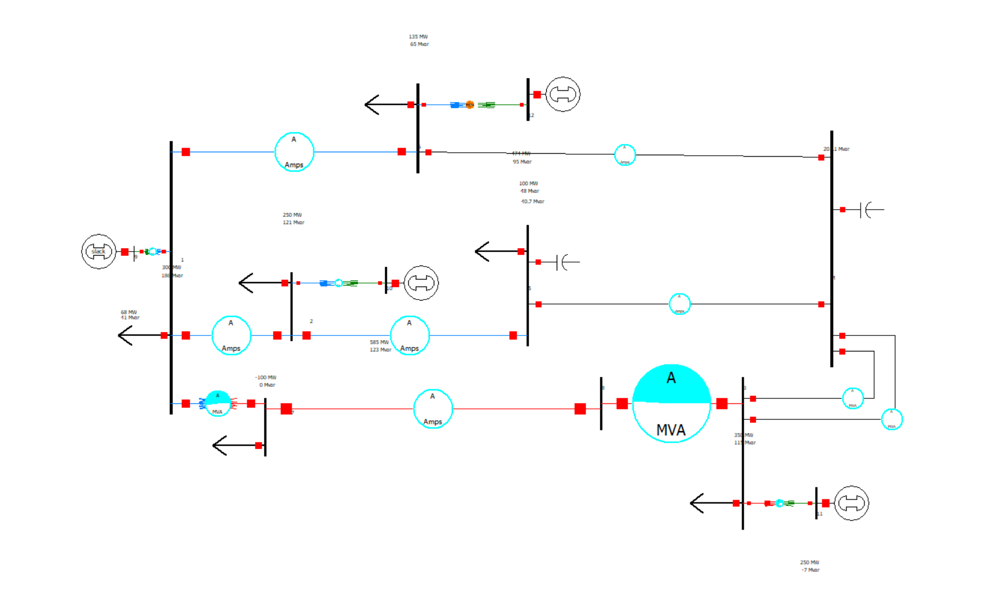
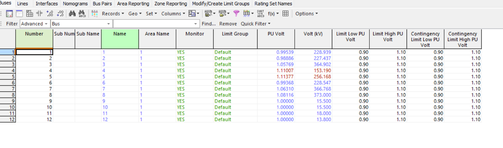
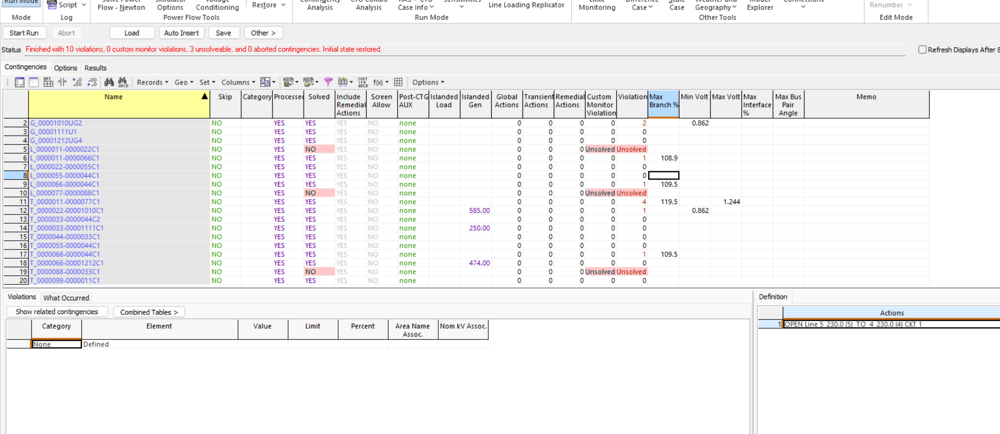
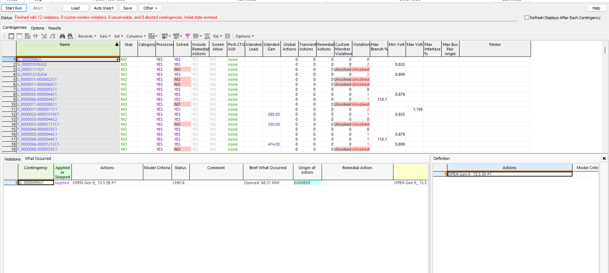

# IEEE_12-Bus_Contingency_Study_-PowerWorld-

## Overview
Objective: Assess whether the power system remains secure and operates within acceptable limits following a disturbance. The study applies the N-1 security criterion, which evaluates the system's ability to continue operating safely after the loss of a single critical component.

<h3>Project Scope</h3>

<ul>
  <li>
    Built a 12-bus power system model using bus, generator, load,
    transmission line, and transformer data.
  </li>
  <li>
    Performed a steady-state power flow analysis to establish the normal
    operating condition of the system.
  </li>
  <li>
    Conducted an N-1 contingency analysis by simulating a transformer outage.
  </li>
  <li>
    Solved the complete post-contingency system and compared the results with
    the base case.
  </li>
  <li>
    Evaluated bus voltages, transmission line loading, power flow
    redistribution, system losses, and operating limit violations.
  </li>
</ul>

<h3>Skills Demonstrated</h3>

<ul>
  <li>Power system modeling</li>
  <li>AC power flow analysis</li>
  <li>N-1 contingency analysis</li>
  <li>Transformer outage assessment</li>
  <li>Power system reliability evaluation</li>
  <li>PowerWorld Simulator</li>
</ul>

## N-0 Base Case Analysis

The N-0 base case represents normal system operation with all transmission lines,
transformers, generators, and loads in service. An AC Newton-Raphson power flow was
performed to establish the reference operating condition before applying any
contingencies.

The corrected system successfully converged with all 12 bus voltages remaining within
the defined 0.90–1.10 pu limits. Bus voltages ranged from 0.984 pu at Bus 2 to
1.053 pu at Bus 7, with no base-case voltage violations. This operating point was
used as the reference state for the subsequent N-1 contingency analysis.

## N-1 Transmission Line Failure

<table>
  <tr>
    <th>Contingency</th>
    <th>Post-Contingency Result</th>
    <th>Primary Issue</th>
  </tr>
  <tr>
    <td>Line 2-5 Outage</td>
    <td>0 Violations</td>
    <td>Acceptable</td>
  </tr>
  <tr>
    <td>Line 5-4 Outage</td>
    <td>0.879 pu Minimum Voltage</td>
    <td>Undervoltage</td>
  </tr>
  <tr>
    <td>Line 6-4 Outage</td>
    <td>110.1% Maximum Branch Loading</td>
    <td>Thermal Overload</td>
  </tr>
  <tr>
    <td>Line 1-2 Outage</td>
    <td>Unsolved Power Flow</td>
    <td>Requires Further Investigation</td>
  </tr>
  <tr>
    <td>Line 1-6 Outage</td>
    <td>Unsolved Power Flow</td>
    <td>Requires Further Investigation</td>
  </tr>
  <tr>
    <td>Line 7-8 Outage</td>
    <td>Unsolved Power Flow</td>
    <td>Requires Further Investigation</td>
  </tr>
</table>

Each transmission line was individually removed from service and the AC power flow
was resolved to determine whether the remaining system could continue operating
within its defined limits.

The N-1 analysis identified several critical transmission-line outages. Loss of the
5–4 line reduced the minimum system voltage to 0.879 pu, violating the 0.90 pu
contingency limit. Loss of the 6–4 line caused a monitored branch to reach 110.1%
loading. Other line outages resulted in unsolved power-flow conditions and were
flagged for further investigation into possible islanding or convergence limitations.

These results demonstrate that although the system operates acceptably under the N-0
base case, it is not fully N-1 secure against every individual transmission-line
outage.

### Corrective Action — Reactive Power Compensation

The outage of transmission line 5–4 initially produced an undervoltage condition and
failed the N-1 contingency criterion. To improve post-contingency voltage support,
reactive compensation was increased near the affected area.

The existing shunt capacitor at Bus 5 was increased from 40 Mvar to 50 Mvar, and an
additional 100 Mvar shunt capacitor was added at Bus 4. After applying these changes,
the 5–4 transmission-line contingency was rerun in PowerWorld.

The modified system successfully solved with zero reported contingency violations,
indicating that the added local reactive-power support was sufficient to restore the
system to an acceptable post-contingency operating condition.

<ul>
    <li>Bus 5 shunt compensation: 40 Mvar to 50 Mvar</li>
    <li>Additional Bus 4 shunt compensation: 100 Mvar</li>
    <li>Original 5–4 outage result: Undervoltage violation</li>
    <li>Post-mitigation 5–4 outage result: 0 violations</li>
    <li>Final N-1 status for 5–4 outage: PASS</li>
</ul>

This corrective-action study demonstrates how targeted reactive-power compensation
can improve voltage security and restore N-1 compliance following a critical
transmission-line outage.

## N-1 Transformer Outage

<table>
  <tr>
    <th>Contingency</th>
    <th>Post-Contingency Result</th>
    <th>Primary Issue</th>
  </tr>
  <tr>
    <td>Transformer 1-7 Outage</td>
    <td>2 Violations; Maximum Voltage 1.195 pu</td>
    <td>Overvoltage</td>
  </tr>
  <tr>
    <td>Transformer 2-10 Outage</td>
    <td>585 MW Islanded Load; Minimum Voltage 0.833 pu</td>
    <td>Islanding / Undervoltage</td>
  </tr>
  <tr>
    <td>Transformer 3-8 Outage</td>
    <td>250 MW Islanded Load; Unsolved Power Flow</td>
    <td>Islanding / Unsolved</td>
  </tr>
  <tr>
    <td>Transformer 3-11 Outage</td>
    <td>0 Violations</td>
    <td>Acceptable</td>
  </tr>
  <tr>
    <td>Transformer 6-12 Outage</td>
    <td>474 MW Islanded Load; Minimum Voltage 0.899 pu</td>
    <td>Islanding / Undervoltage</td>
  </tr>
  <tr>
    <td>Transformer 8-3 Outage</td>
    <td>Unsolved Power Flow</td>
    <td>Requires Further Investigation</td>
  </tr>
</table>

Each transformer was individually removed from service to evaluate the system's
ability to withstand a single transformer outage. Following each contingency,
the AC power flow was resolved and the resulting bus voltages, equipment loading,
islanding, and convergence were evaluated.

The analysis identified several critical transformer contingencies. Some transformer
outages produced post-contingency voltage violations, including minimum bus voltages
of approximately 0.833 pu and 0.899 pu. Other transformer outages resulted in
electrical islanding, with isolated generation or load, while several cases could
not obtain a valid post-contingency power-flow solution.

These results indicate that the IEEE 12-bus system is not fully N-1 secure against
all transformer outages. The critical cases identify transformers whose loss either
weakens voltage support, isolates portions of the network, or prevents the remaining
system from reaching an acceptable steady-state operating condition.

