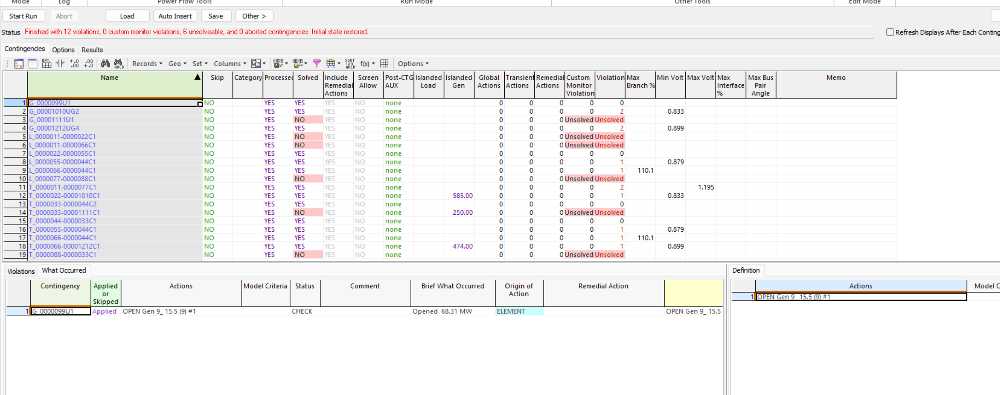

# IEEE_12-Bus_Contingency_Study_-PowerWorld-

## Overview
Objective: Assess whether the power system remains secure and operates within acceptable limits following a disturbance. The study applies the N-1 security criterion, which evaluates the system's ability to continue operating safely after the loss of a single critical component.

<h3>Project Scope</h3>

<ul>
  <li>
    Built a 12-bus power system model using bus, generator, load,
    transmission line, and transformer data.
  </li>
  <li>
    Performed a steady-state power flow analysis to establish the normal
    operating condition of the system.
  </li>
  <li>
    Conducted an N-1 contingency analysis by simulating a transformer outage.
  </li>
  <li>
    Solved the complete post-contingency system and compared the results with
    the base case.
  </li>
  <li>
    Evaluated bus voltages, transmission line loading, power flow
    redistribution, system losses, and operating limit violations.
  </li>
</ul>

<h3>Skills Demonstrated</h3>

<ul>
  <li>Power system modeling</li>
  <li>AC power flow analysis</li>
  <li>N-1 contingency analysis</li>
  <li>Transformer outage assessment</li>
  <li>Power system reliability evaluation</li>
  <li>PowerWorld Simulator</li>
</ul>

## N-0 Base Case Analysis

The N-0 base case represents normal system operation with all transmission lines,
transformers, generators, and loads in service. An AC Newton-Raphson power flow was
performed to establish the reference operating condition before applying any
contingencies.

The corrected system successfully converged with all 12 bus voltages remaining within
the defined 0.90–1.10 pu limits. Bus voltages ranged from 0.984 pu at Bus 2 to
1.053 pu at Bus 7, with no base-case voltage violations. This operating point was
used as the reference state for the subsequent N-1 contingency analysis.

## N-1 Transmission Line Failure

Each transmission line was individually removed from service and the AC power flow
was resolved to determine whether the remaining system could continue operating
within its defined limits.

The N-1 analysis identified several critical transmission-line outages. Loss of the
5–4 line reduced the minimum system voltage to 0.879 pu, violating the 0.90 pu
contingency limit. Loss of the 6–4 line caused a monitored branch to reach 110.1%
loading. Other line outages resulted in unsolved power-flow conditions and were
flagged for further investigation into possible islanding or convergence limitations.

These results demonstrate that although the system operates acceptably under the N-0
base case, it is not fully N-1 secure against every individual transmission-line
outage.

